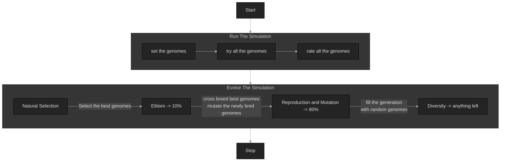

# Basic Genetic Algorithm

## Table of Contents
- [Basic Genetic Algorithm](#basic-genetic-algorithm)
  - [Table of Contents](#table-of-contents)
  - [Diagrams](#diagrams)
    - [Main Logic](#main-logic)
- [Dependencies](#dependencies)
  - [Dependency: Emscripten 3.1.26 (for web-wasm build)](#dependency-emscripten-3126-for-web-wasm-build)
  - [Dependency: Geronimo 0.0.4](#dependency-geronimo-004)
- [How to Build](#how-to-build)
  - [Build Everything (will skip web-wasm if emscripten is absent)](#build-everything-will-skip-web-wasm-if-emscripten-is-absent)
- [Thanks for watching!](#thanks-for-watching)

## Diagrams


### Main Logic



# Dependencies

## Dependency: Emscripten 3.1.26 (for web-wasm build)
```bash
git clone https://github.com/emscripten-core/emsdk.git

cd emsdk

./emsdk install 3.1.26
./emsdk activate --embedded 3.1.26

. ./emsdk_env.sh

em++ --clear-cache
```

## Dependency: Geronimo 0.0.4

This dependency will be donwloaded and built with the `Build Everything` method below

# How to Build

## Build Everything (will skip web-wasm if emscripten is absent)

```bash
chmod u+x ./sh_everything.sh
./sh_everything.sh
# will tell if a dependency is missing
# will skip the web-wasm build if emscripten is not detected
```

# Thanks for watching!
